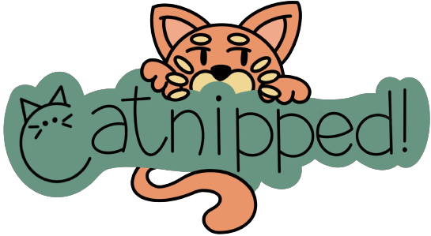
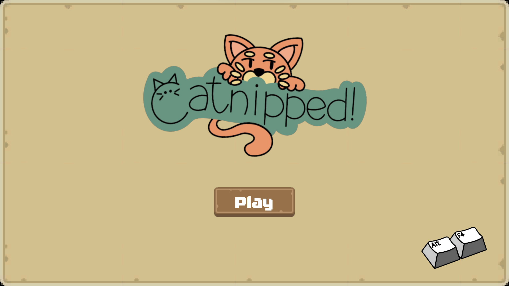
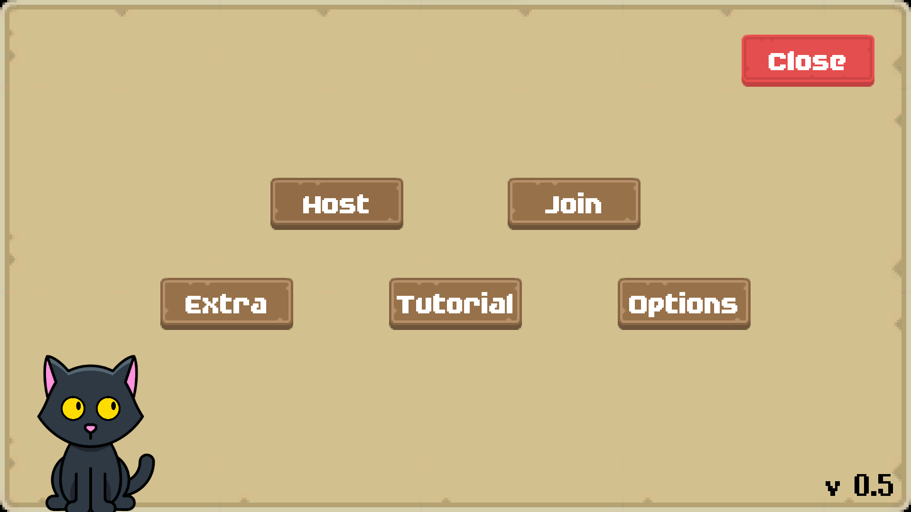
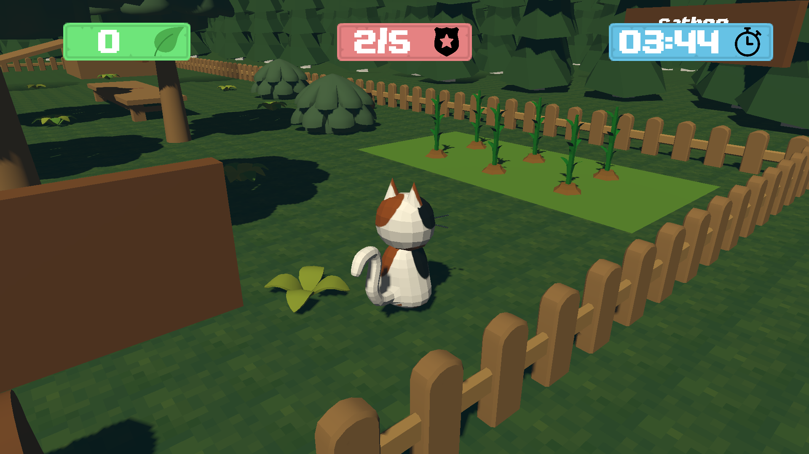
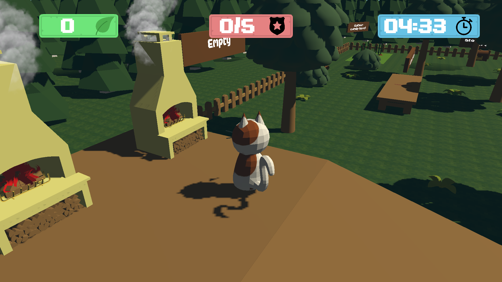
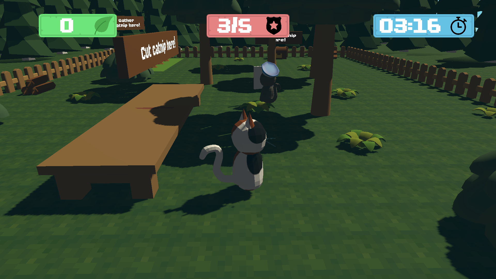
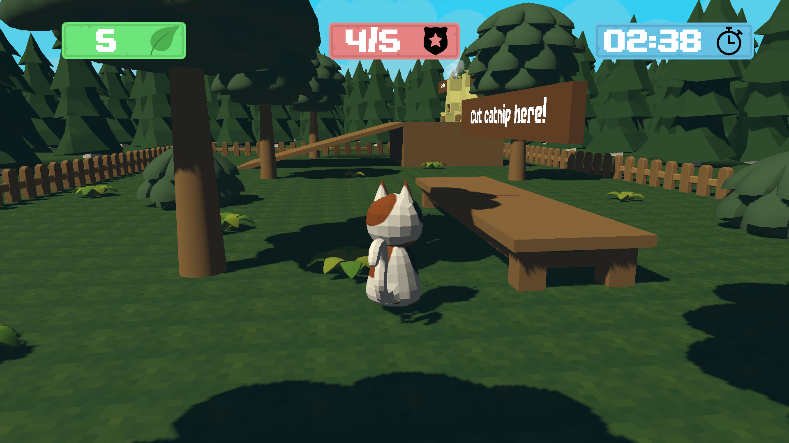

A cooperative multiplayer 3D game built with Unity where 2–4 players run an underground catnip operation — harvesting, cooking, and processing catnip while defending against P.U.P.S. (Paws United for Protecting Society) raids.

Developed as a team of three for the **Online Game Design** course at university.

- [Play on itch.io](https://pietroarsi.itch.io/catnipped)
- [Game Design Document (GDD)](GDD_Catnipped.pdf)
- [Technical Design Document (TDD)](TDD_Catnipped.pdf)

---

## Gameplay

Players collaborate under a 5-minute time limit to maximize catnip production across a multi-step pipeline:

1. **Harvest** raw catnip from the field
2. **Cook** it in furnaces (5–10 seconds)
3. **Cut** the cooked batch on cutting tables (5 seconds)
4. **Store** the finished product

While managing production, players must fend off enemy dogs and pawlice officers. Letting the **evidence counter** reach 5 triggers a game over. Performance is scored with 1–3 "crunchies" (stars) based on output volume.

Additional mechanics: catch mice for bonus points, build defensive traps and walls via a construction menu, and coordinate roles across up to 4 players.

---

## Screenshots

<table>
  <tr>
    <td></td>
    <td></td>
  </tr>
  <tr>
    <td></td>
    <td></td>
  </tr>
  <tr>
    <td></td>
    <td></td>
  </tr>
</table>

---

## Tech stack

| Layer | Technology |
|---|---|
| Engine | Unity 2021.3.22f1 (LTS) |
| Language | C# |
| Networking | Unity Netcode for GameObjects 1.2.0 |
| Matchmaking | Unity Relay + Lobby Services |
| Rendering | Universal Render Pipeline (URP) |
| Camera | Cinemachine 2.8.9 |
| UI | TextMesh Pro, UGUI |
| Navigation | Unity NavMesh |

---

## Architecture highlights

### Networked state machine

The game's network lifecycle runs through a server-authoritative state machine (`GameManagerStates.cs`):

1. Wait for all clients to spawn into the level
2. Run a pre-match countdown
3. Keep game state in sync across host and clients during the match
4. Resolve win/loss and transition everyone to the end screen
5. Handle host or client drops at any phase

State is synchronized via `NetworkVariable<State>` with `OnValueChanged` callbacks. Only the host drives transitions; clients react to changes.

### Priority-based interaction system

When a player stands near multiple interactables at once, `PickAndPlace.cs` picks the highest-priority one using a score from `SpawnableObjParent.GetPriority()`. No disambiguation needed from the player.

### Client-server architecture

- Host manages game state, enemy spawning, and win/loss conditions via `[ServerRpc]`
- State broadcasts use `[ClientRpc]` for UI updates, sound effects, and object visibility
- Each `PlayerNetwork` instance exposes a `LocalInstance` reference, populated only on the owning client, so input handling stays strictly local

### Player session management

`ConnectionManager.cs` (singleton) maintains a `NetworkList<PlayerData>` visible to all clients. It handles color assignment, player name generation, Unity Authentication integration, and graceful disconnect for both host and client mid-lobby and mid-game.

### Enemy AI

Dogs spawn at 30-second intervals and navigate via NavMesh agents (`NetworkNavMeshAgent.cs`). Mice roam independently and can be caught by players for bonus points.

---

## Key systems

- Cooking and cutting pipelines: timed multi-stage resource processing with network-synchronized states
- Evidence system: tracks pawlice suspicion; hitting 5 ends the game
- Achievement system: persistent unlocks across sessions via `SaveManager`
- Construction menu: runtime placement of traps and walls
- Dynamic scoring: crunchies rating computed from final production volume
- Audio management: separate managers for BGM, player SFX, and UI feedback

---

## Scenes

| Scene | Purpose |
|---|---|
| MainMenu | Title screen |
| LobbyManagement | Create or browse lobbies |
| CharacterSelectionScreen | Pick character before match |
| LevelSelection | Choose map |
| NetworkTestLevel | Main gameplay level |

---

## Controls

| Input | Action |
|---|---|
| WASD | Move |
| Mouse | Camera |
| Left Click | Interact / Scratch |
| E | Cut catnip |
| Q | Open construction menu |
| M | Meow |

---

## Team

Built by a team of three over one academic semester:

- **Pietro Arsi** — UI systems, gameplay mechanics, scoring
- **Luca Ghisi** — networking foundation, enemy systems
- **Giovanni Morlacchi** — game design, level design, concept and additional gameplay contributions

---

## Running the project

1. Install **Unity 2021.3.22f1** (available via Unity Hub)
2. Clone the repository
3. Open the project folder in Unity Hub
4. Open `Assets/Scenes/MainMenu.unity`
5. Press Play — or build via **File → Build Settings**

An internet connection is required for multiplayer (Unity Relay handles NAT traversal; no dedicated server needed).
